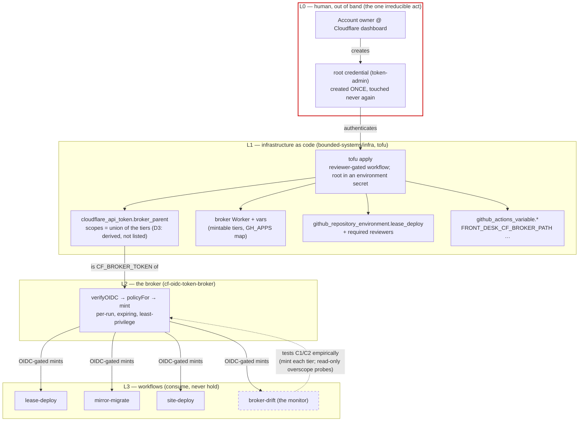

# The credential chain

Decided 2026-07-28, prompted by a live mint failure (HTTP 502, cf 9109). The
question was "can't the mint set up its own infrastructure?" and the answer is a
map, because it is *yes for one half and structurally no for the other* — and
the boundary between the halves is the security model.

Three artifacts carry this design, in the house pattern (model ⇄ experiment):

| artifact | role |
|---|---|
| `specs/lean/Delegation.lean` | proves D1–D3 from named assumptions C1/C2 |
| `.github/workflows/broker-drift.yml` | the experiment that tests C1/C2 in the world |
| `proposals/infra/broker-tofu/` | the phase-3 config that makes drift unrepresentable (D3) |

The theorems are only as good as the assumptions; the monitor is what binds the
assumptions to the deployment. Same relationship `Leases.lean` has to
`claim-race.yml`.

## The map

Authority flows down every solid arrow. **No arrow points up.** That absence is
the design, and it is why the answer to "fix the 9109 with the mint" is no.

## The invariants, named

| id | statement | where established |
|----|-----------|-------------------|
| **D1** | every attainable token is bounded by the root, over any chain of mints/edits | proven (`attainable_le_root`) |
| **D2** | authority the root lacks is unattainable from below — the 9109 has no in-band fix | proven (`cannot_widen_from_below`) |
| **D3** | a tier *defined as* a restriction of the parent cannot drift from it | proven (`derived_tiers_never_drift`), implemented by `scopes.tf` |
| **C1** | the engine caps a minted/edited token at its creator's scopes | **assumption — unresolved**, tested by `broker-drift` |
| **C2** | nothing below L0 holds management scope over the root | assumption — structural in the model, probed by `broker-drift` |

### C1 is honestly uncertain

The observed 9109 is consistent with C1 (the parent lacked the scope, the mint
was refused). But the broker's own SECURITY.md R4 says "API Tokens: Edit" can
mint *up to the account owner's full scope*, which contradicts it — under that
reading the 9109 was a policy-resource mismatch instead. The two readings
predict different monitor outcomes, so `broker-drift` decides rather than
either document. If C1 is false, D1's real-world reading collapses and the
response is R4's own: treat the parent as account-root — which the tofu draft
does regardless, by giving the parent exactly the union of the mintable tiers
and nothing else.

## What drifted, and why phase 3 removes the class

Today the parent's scopes live in the **dashboard** and the broker's requested
policy lives in **code**. Two sources of truth that must agree; the 9109 is
what their disagreement looks like at runtime
(`independent_definitions_can_drift` — proven by witness, observed in
production the same day).

`proposals/infra/broker-tofu/scopes.tf` defines the tiers once and *derives*
the parent as their union. After that, `Sub tier parent` holds by construction
— drift stops being a detectable failure and becomes an unrepresentable one
(`restrict_never_drifts`). Detection (the monitor) stays anyway, because the
tofu state and the dashboard can still diverge until phase 2 retires the
hand-made token.

## What the mint CAN bootstrap

The GitHub half of L1 needs no new stored secret: the broker already mints
Front Desk App tokens, and with `environments: write` + `variables: write` in
the `GH_APPS` map, a per-run App token can create the `lease-deploy`
environment, set its reviewers, and set the repo variables — including
authenticating the tofu GitHub provider for an apply. The Cloudflare half
cannot be bootstrapped from below (D2), which is why L0 exists.

## Phases

0. **Now, dashboard, 5 min** — inspect/extend the current parent
   (`a30f2572…`); dispatch `lease-deploy`; discharge A2. Not hostage to the
   rest.
1. **GitHub half** — tofu module in infra, provider authenticated by a
   broker-minted App token; environments/reviewers/variables become resources.
2. **Cloudflare half** — create the token-admin root once, park it gated in
   infra, bring `broker_parent` + broker vars under tofu, retire hand-made
   tokens. ⚠ tofu state then **contains token values**: the backend (R2) is
   credential storage and must be treated as such.
3. **The payoff** — tiers and parent scopes derive from one `locals` block;
   `broker-drift` goes permanently green for scope reasons or the model is
   wrong, and either outcome is information.

## Boundary worth keeping

tofu manages **standing** configuration (environments, variables, token
policies). Workflows manage **derived outputs** (`FDS_CLAIM_ENDPOINT` is set by
`lease-deploy` from the URL it just deployed). Blurring that line puts a value
tofu cannot know into state, or a reviewed grant into an unreviewed run.
